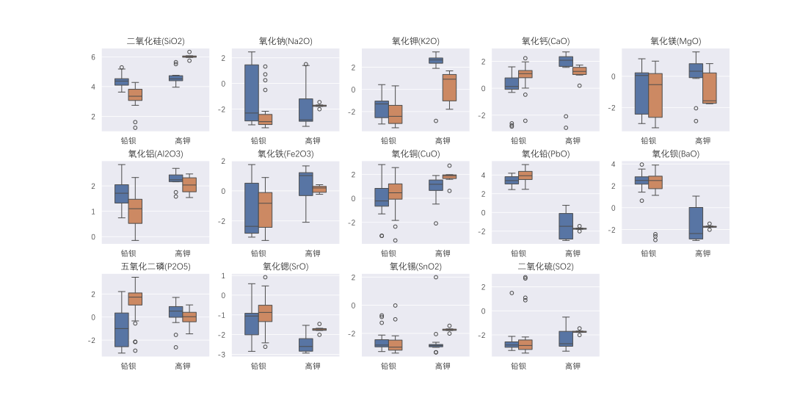
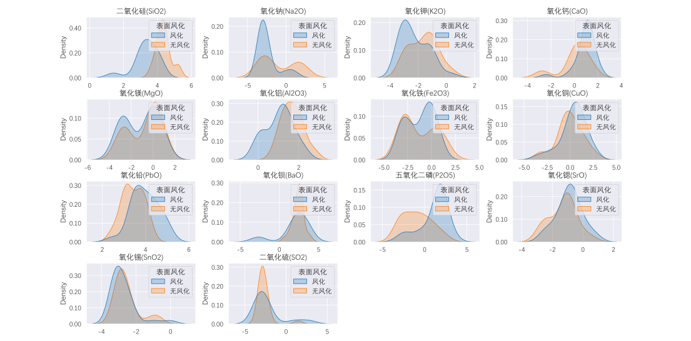
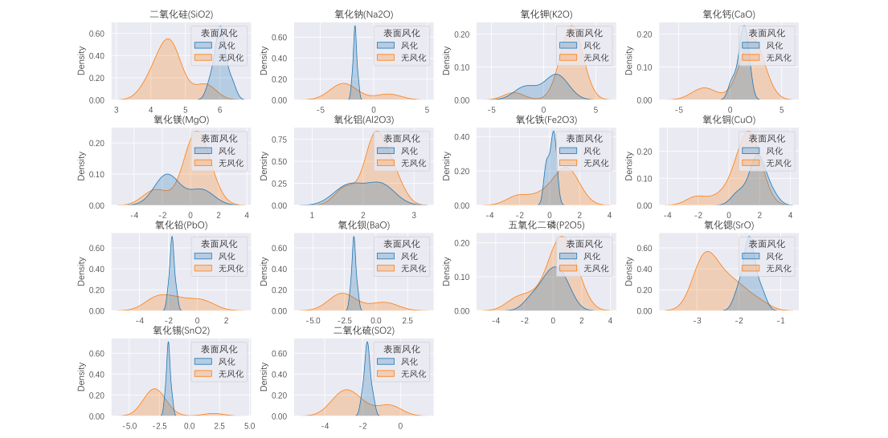
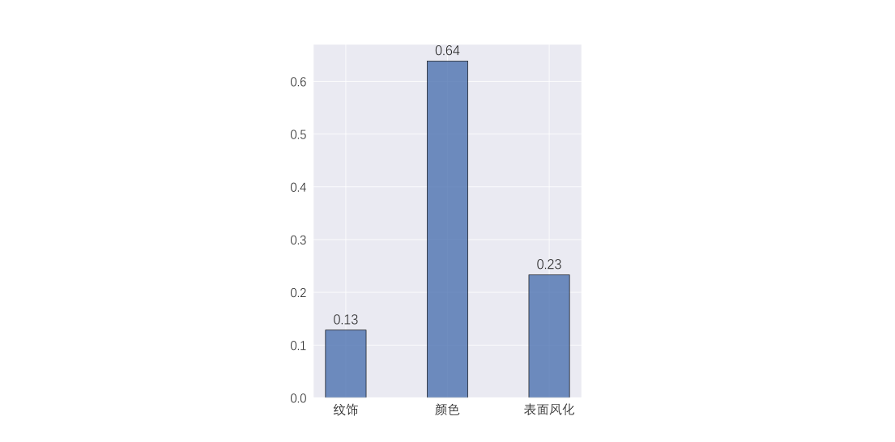
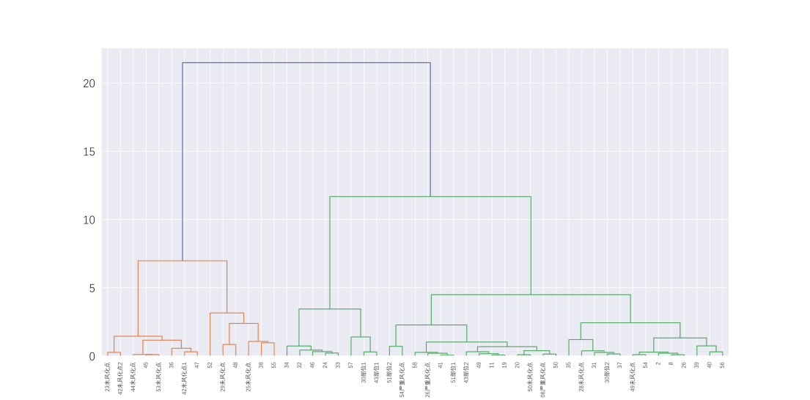
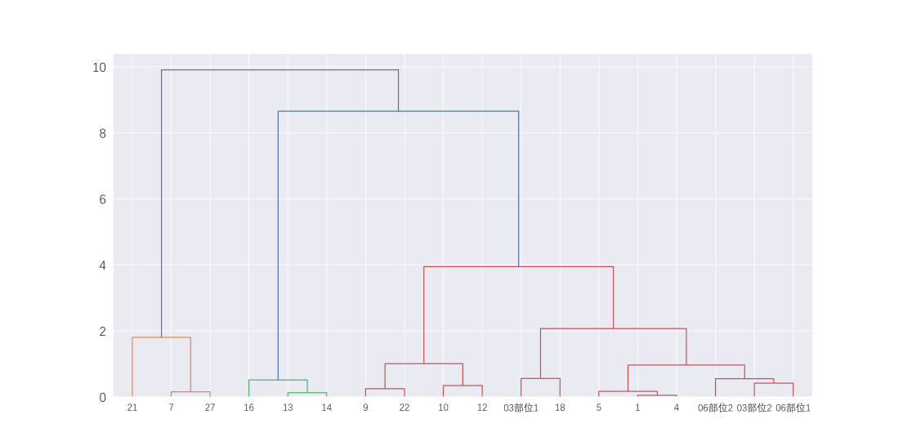
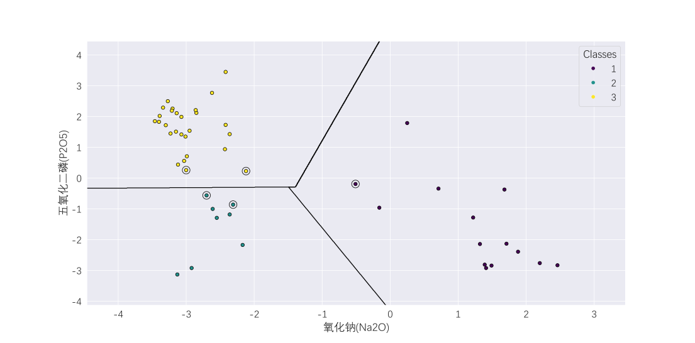
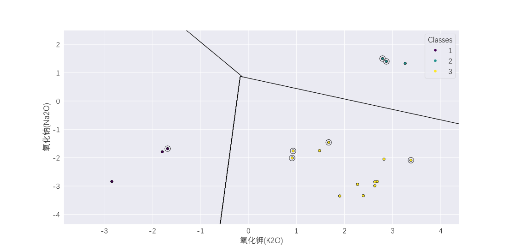
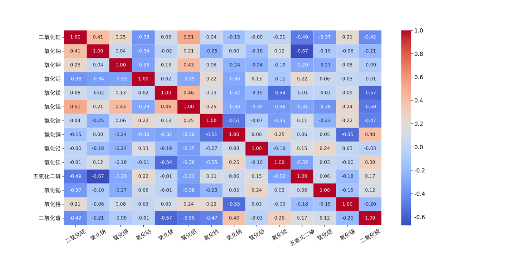
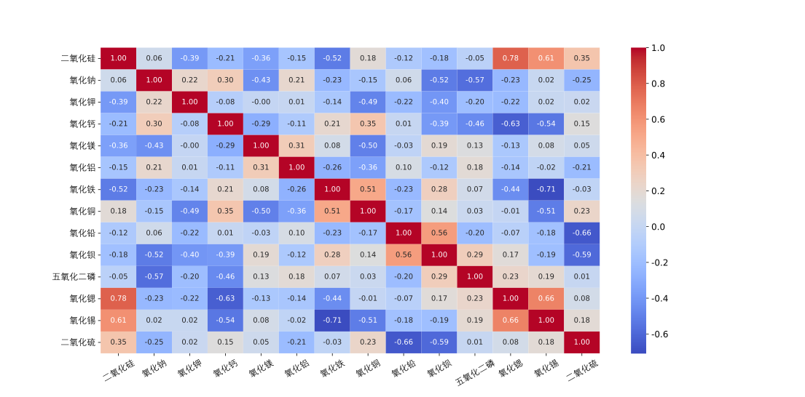

# 2022 数模国赛：古代玻璃制品的成分分析与鉴别

## 一、数据预处理

> [!NOTE]
> 附件 2 中若采样点明确标注为“严重风化点”，则将该采样点标签改为“风化”；若明确标注为“未风化点”，则将标签改为“无风化”。否则与附件 1 中标明的风化类型一致。

### 1.1 物品颜色的处理

基于“物以类聚，人以群分”的思想，通过列举与待测物品已有信息最相似的物品的相关信息，从而预测待测物品位置信息的情况。具体操作为，在已知的与其除颜色外其余基本信息均相同的样本中，统计不同颜色出现的频数，将出现频数最高的颜色填补为该采样点的颜色。基于此，将所有 4 个采样点的颜色缺失值均填补为“淡蓝色”。

### 1.2 化学成分的处理

1. 根据题中表述，删除成分比例的累加和介于 85% 和 105% 以外的数据。
2. 对缺失值统一使用 0.04 进行填充，若原先值为 0 的也统一修改为 0.04。其合理性在于，成分数据的缺失值或零值通常是由于检测仪器的精度问题导致，考察本数据集非零数据的最小值为 0.04%，因此可以使用 0.04 进行填充。此外，还可避免进行 CLR 变换时出现大量的 Inf 和 NaN。
3. 数据集给出的数据为成分数据。该类数据的分析应聚焦于各成分之间的相对含量而非绝对比例，且数据本身具有高维、稀疏、右偏的特征。基于此对数据进行中心对数比变换（CLR），变换后的数值反映了每个玻璃文物中各个化学成分的相对重要性，并在一定程度上解决了成分数据的不良性质。

> [!TIP]
> 在统计学中，成分数据是对某一整体各部分的定量描述，传递相对信息。涉及概率、比例、百分比等都可以看作是成分数据。中心对数比变换是一种主要用于成分数据分析的技术，特别是在成分总和为 1 的比例或百分比（即单纯形空间）的多元数据环境中。中心对数比变换的逆变换为 softmax 函数。

## 二、问题一：玻璃文物风化的表征与风化前的成分预测

### 2.1 玻璃表面风化与其类型、纹饰和颜色的关系

> 由于玻璃表面是否风化以及玻璃类型、纹饰和颜色均为定类变量，因此考虑以表面风化为结果变量分别和类型、纹饰、颜色构造列联表，并根据样本容量的大小分别做卡方独立性检验或 Fisher 精确检验，得出纹饰、颜色与表面风化情况无关，而玻璃类型与风化情况有较强关联。具体检验结果见[问题 1-假设检验.xlsx](问题1-假设检验.xlsx)。

卡方独立性检验是在样本量较大时用于列联表分析的非参数假设检验。简单来说，这个检验主要用于检查两个分类变量（列联表中的两个维度）是否在影响检验统计量（表格中的数值）时相互独立。卡方检验在样本容量较大时有效，SciPy 建议每个观测值均应大于等于 5。由于卡方独立性检验是非参数假设检验，因此无需假设数据服从某一特定分布。当样本容量较小时，建议使用 Fisher 精确检验代替。

Fisher 精确检验是在样本量较小时用于列联表分析的非参数假设检验，仅适用于 2x2 列联表。原假设是列联表中两个分类变量之间没有非随机关联，而备择假设是存在非随机关联。由于 Fisher 精确检验是非参数假设检验，因此无需假设数据服从某一特定分布。根据维基百科，虽然 Fisher 精确检验通常用于样本容量较小的情况，但在样本容量较大时同样适用。传统 Fisher 精确检验仅能用于 2x2 列联表，后续有学者提出适用于任意大小列联表的 Fisher 精确检验，通常基于蒙特卡洛方法。

> [!NOTE]
> 自 SciPy 1.15.0 版本起，Fisher 精确检验支持任意 2 维列联表，在之前的版本中仅支持 2x2 列联表。MATLAB `fishertest` 函数仅支持 2x2 列联表。为确保两者行为一致，建议在进行玻璃类型与表面风化情况检验时采用 Fisher 精确检验，其余情况采用卡方检验。Python 程序中同时提供了两种检验方式，以供参考。

### 2.2 各类玻璃风化前后的化学成分的统计规律

> 本题主要通过箱线图和核密度估计法，从定性和定量的两个角度，分别研究了高钾玻璃和铅钡玻璃在风化与未风化文物中各个化学成分的差异。得出高钾玻璃中二氧化硅、氧化钠等七个化学成分差异显著，铅钡玻璃中氧化钾、氧化钙等八个化学成分差异显著的结论。最后，分别对铅钡和高钾风化前和风化后的化学成分含量进行 Wilcoxon 秩和检验，判断两者是否来自不同分布。具体检验结果见[问题 1-假设检验.xlsx](问题1-假设检验.xlsx)。

偏斜度是衡量数据围绕样本均值的不对称程度的指标。如果偏斜度为负，说明数据相对于均值的左侧分布更广泛；如果偏斜度为正，说明数据相对于均值的右侧分布更广泛。正态分布（或任何完全对称的分布）的偏斜度为零。

峰度是衡量分布是否容易出现异常值的指标。正态分布的峰度为 3。相比正态分布，越容易出现异常值的分布，其峰度大于 3；而不容易出现异常值的分布，其峰度小于 3。有些峰度的定义会从计算值中减去 3，这样正态分布的峰度为 0。

箱线图提供了样本数据的摘要统计可视化，包含以下特点：

- 每个箱体的底部和顶部分别是样本数据的第 25 百分位数和第 75 百分位数。箱体底部和顶部之间的距离是四分位距。
- 每个箱体中间的红线是样本的中位数。如果中位数不在箱体的中心，则图表显示样本的偏斜度。
- 须状线是从每个箱体上方和下方延伸的线段。须状线从四分位距的末端延伸到最远的非异常值的观测值。
- 超出须状线长度的观测值被标记为异常值。默认情况下，异常值是指距离箱体底部或顶部超过 1.5 倍四分位距的值。
- 缺口用于比较多个箱形图的样本中位数。如果两个箱形图的缺口不重叠，那么它们的中位数在 5% 的显著性水平下是不同的。显著性水平是基于正态分布假设的，但中位数的比较对于其他分布来说也具有合理的稳健性。

核分布是一种非参数化表示随机变量概率密度函数（pdf）的方法。当参数化分布无法适当地描述数据，或当希望避免对数据的分布做出假设时，可以使用核分布。核分布由平滑函数和带宽值定义，这两个参数控制生成的密度曲线的平滑度。当带宽值增大时，概率密度函数更光滑。

> [!NOTE]
> MATLAB `kde` 函数默认的平滑函数为高斯函数，带宽默认值为"normal-approx"；Scikit-learn `KernelDensity` 函数默认的平滑函数为高斯函数，带宽默认值为 1.0；Scipy `gaussian_kde` 函数的带宽默认值为"scott"。为确保三者行为一致，可将 `KernelDensity` 的 "bandwidth" 参数设置为 "silverman"，`gaussian_kde` 的 "bw_method" 参数设置为 "silverman"。MATLAB `kde` 函数需要 R2023b 以上版本。

下图中第一幅图为铅钡化学成分含量核密度图，第二幅图为高钾化学成分含量核密度图。

Wilcoxon 秩和检验（Wilcoxon rank-sum test）检验零假设，即两个数据集来自相同的分布。备择假设是一个样本中的值比另一个样本中的值更可能更大。

Wilcoxon 秩和检验主要用于比较两个独立样本是否来自相同的分布，并假设这两个样本相互独立，且数据不需要符合正态分布。其原假设是两者来自相同的分布。Wilcoxon 符号秩检验主要用于比较两组相关或配对样本（比如同一组样本的前后测量数据）的变化是否显著，且数据不需要符合正态分布。其原假设是 x 与 y 的差值来自一个中位数为 0 的分布。

> [!NOTE]
> MATLAB 提供 `ranksum`（Wilcoxon 秩和检验）和 `signrank`（Wilcoxon 符号秩检验）两种检验方法，并明确说明 Mann-Whitney U 检验与 Wilcoxon 秩和检验一致。然而，SciPy 提供 `ranksums`（Wilcoxon 秩和检验）、`wilcoxon`（Wilcoxon 符号秩检验）和 `mannwhitneyu`（Mann-Whitney U 检验）三种检验方法。上述所有检验均为非参数假设检验，即不对数据的分布做任何假设。

### 2.3 化学成分含量的预测

> 由于已有数据绝大多数为不同文物的前后风化点的化学成分含量，无法精确将某一风化后的成分对应到风化前的成分数据，因此本文使用描述性统计的方法，给出了预测风化文物风化前相对成分含量的模型，进行了成分还原。具体操作为，首先计算风化前后各个化学元素含量的均值差，再将风化后的元素含量加上此均值差，即为风化前的元素含量。最后进行逆中心对数比变换，即为最终结果。预测结果见[问题 1-铅钡高钾还原数据.xlsx](问题1-铅钡高钾还原数据.xlsx)。

## 三、问题二：基于 SVM 和层次聚类对玻璃文物的分类研究

### 3.1 铅钡高钾玻璃分类规律的挖掘

> 本题从指标型和数值型两大类探究文物的分类规律。对于指标型数据（附件 1），使用决策树模型，对每个玻璃样本进行二分类，基于基尼指数计算每个指标对应的重要程度。在数值型变量的研究中，选择降维后通过 SVM 得到高钾和铅钡玻璃的显式分类表达式。降维方法为，比较铅钡和高钾不同元素取均值后的差异，按照从大到小排序，选取差异最大的两个作为变量。此处选择的指标为氧化铅和氧化钡。

决策树是一种树形结构的模型，用于分类和回归任务。它通过不断地将数据划分为不同的子集，直到达到一定的终止条件（如树的深度或子集中的样本数小于某个阈值）。每个节点代表一个特征的判定条件，每条分支代表可能的输出，而叶节点则代表最终的预测结果。决策树以及其他所有的树类算法均可计算变量的重要性。其值介于 0-1 之间，值越大表示重要性越大。

支持向量机是一种基于最大间隔原则的监督学习方法，广泛应用于分类问题。它通过寻找一个超平面来最大化不同类别之间的间隔（即支持向量的距离），从而进行分类。SVM 不仅能够处理线性可分的情况，还能通过核函数（如高斯核）映射到高维空间，处理非线性分类问题。SVM 较为适合应用于高维数据。若 SVM 使用的核函数为线性核函数，则可以显式还原超平面的函数表达式。

> [!NOTE]
> 若数据集为高维数据，在 MATLAB 中请使用 `fitclinear`，并指定模型为 `svm`；在 Python 中请使用 `LinearSVC`。对于低维到中维数据，在 MATLAB 中请使用 `fitcsvm`，在 Python 中请使用 `SVC`。对于线性不可分数据，请在使用 `fitcsvm` 或 `SVC` 的同时，指定核函数为 `rbf`。注意，对于高维数据，默认算法为随机梯度下降法，支持 L1 和 L2 正则化；对于低维到中维数据，默认算法为 SMO 算法。

### 3.2 铅钡高钾玻璃亚类划分的研究

> 在亚类的分类方面，计算每个化学元素含量的方差大小，通过方差大小筛选出了区分亚类的化学成分。方差能反映一组数据的离散程度，在本问题中能反映化学成分的相对重要性，在不同文物之间的变化离散性。故一个化学成分的方差越大，亚类划分的意义就越明显。经过方差计算，在铅钡玻璃中选取氧化钠和五氧化二磷作为分类依据，在高钾玻璃中选取氧化钾和氧化钠作为分类依据。随后，对筛选后的指标进行层次聚类，将铅钡玻璃划分为高钠低磷、低钠低磷、低钠高磷三种类型，将高钾玻璃划分为低钠高钾、高钠富钾、低钠富钾三种类型，并再次通过 SVM 给出显式分类表达式。由于数据点是线性可分的，因此使用线性核函数作为 SVM 的核函数。

层次聚类通过计算不同类别数据点间的相似度来创建一棵有层次的嵌套聚类树。其聚类主要根据的是数据与数据之间的“距离”判别其相似程度。相比于其他聚类算法，层次聚类的目标是通过逐步合并或分割数据点，形成一个树状结构（通常叫做`树状图`或`dendrogram`），以便观察数据的层次关系。从每一个观测数据出发，每一次通过合并最相似的聚类来形成上一层次中的聚类，当所有观测数据被聚为一类时，聚类算法停止。层次聚类有两种主要方法，凝聚式（Agglomerative）层次聚类和分裂式（Divisive）层次聚类。凝聚式层次聚类从每个数据点作为一个单独的簇开始，然后逐步将距离最近的簇合并成更大的簇，直到所有数据点都被合并到一个簇中。最常用的距离度量方式是欧氏距离，合并簇的方法有多种，比如最短距离法（单链接）、最长距离法（全链接）、平均距离法等。分裂式层次聚类从所有数据点在同一个簇开始。然后逐步根据某种准则将簇分裂成更小的簇，直到每个簇只包含一个数据点。分裂式层次聚类相对较少使用，因为其计算开销通常较大。

下图中第一幅图为铅钡化学成分含量层次聚类图，第二幅图为高钾化学成分含量层次聚类图。

下图中第一幅图为铅钡化学成分含量 SVM 分类图，第二幅图为高钾化学成分含量 SVM 分类图。

## 四、问题三：对未知类别文物的分类研究

> 结合上述结论，首先对未知文物使用 SVM 分类器，针对氧化铅和氧化钡两个指标进行粗分类。其次，根据前文中的聚类结果，再次使用 SVM 分类器，在铅钡玻璃中选取氧化钠和五氧化二磷作为分类依据，在高钾玻璃中选取氧化钾和氧化钠作为分类依据，对文物进行亚类划分。得出结论：A1、A6、A7 属于高钾玻璃，其余属于铅钡玻璃。在铅钡玻璃中，A5 属于“高钠低磷”型，其余属于“低钠高磷”型；在高钾玻璃中，A1 属于“低钠高钾”型，A6、A7 属于“低钠富钾”型。

## 五、问题四：不同类别化学成分关联与差异的研究

> 本题使用相关系数热力图判断两类玻璃样本下的化学成分比例差异，使用非参数 K-S 检验法比较不同类别之间在化学成分关联关系上的差异性。最终得出氧化钾、氧化铝在玻璃亚类之间的化学成分关联关系具有显著差异性的结论。

相关系数是衡量某种线性相关性的数值度量，表示两个变量之间的统计关系。这些变量可以是给定数据集中的两列观测值（通常称为样本），也可以是具有已知分布的多变量随机变量的两个组成部分。目前主要存在 3 种类型的相关系数，每种都有自己的定义、适用范围和特点。它们的取值范围都在 -1 到 +1 之间，其中 ±1 表示最强的相关性，0 表示没有相关性。作为分析工具，相关系数存在一些问题，包括某些类型可能会受到异常值的影响，以及可能被错误地用来推断变量之间的因果关系。

皮尔逊相关系数衡量两个数据集之间的线性关系。p 值的计算依赖于假设每个数据集都服从正态分布。像其他相关系数一样，皮尔逊相关系数的取值范围在 -1 到 +1 之间，0 表示没有相关性。-1 或 +1 的相关系数意味着两个变量之间存在完全的线性关系。

斯皮尔曼相关系数是一种非参数度量，用于衡量两个数据集之间的线性关系。与皮尔逊相关系数不同，斯皮尔曼相关系数不假设两个数据集都服从正态分布。像其他相关系数一样，斯皮尔曼相关系数的取值范围也是 -1 到 +1，其中 0 表示没有相关性。-1 或 +1 的相关系数意味着存在单调关系。正相关意味着当 x 增加时，y 也增加；负相关则意味着当 x 增加时，y 减少。p 值大致表示一个无相关性的系统生成的数据集具有与从这些数据集计算出的斯皮尔曼相关系数至少同样极端的概率。p 值并不完全可靠，但对于大于 500 的数据集来说，它们可能是合理的。

肯德尔相关系数是衡量两个排序之间一致性的指标。接近 1 的值表示强一致性，接近 -1 的值表示强不一致性。该方法实现了肯德尔 τ 的两种变体：tau-b（默认）和 tau-c（也称为斯图尔特的 tau-c）。这两者的不同之处仅在于它们是如何归一化以确保值在 -1 到 1 范围内；其假设检验的 p 值是相同的。肯德尔的原始 τ-a 没有单独实现，因为在没有平局值的情况下，tau-b 和 tau-c 会简化为 τ-a。

> [!NOTE]
> 维基百科说明斯皮尔曼相关系数用于度量两个变量间的单调关系（线性或非线性），但是 SciPy 文档中说明斯皮尔曼相关系数仅用于度量两个变量间的线性关系。

下图中第一幅图为铅钡化学成分含量相关系数图，第二幅图为高钾化学成分含量相关系数图。

科尔莫戈罗夫–斯米尔诺夫检验（Kolmogorov–Smirnov test，简称 K–S 检验）是一种非参数检验，用于检验连续一维概率分布的相等性。它可以用于检验一个样本是否来自某个给定的参考概率分布（单样本 K–S 检验），或者检验两个样本是否来自同一分布（双样本 K–S 检验）。其原假设为两者来自相同的概率分布，备择假设为两者来自不同的概率分布。
