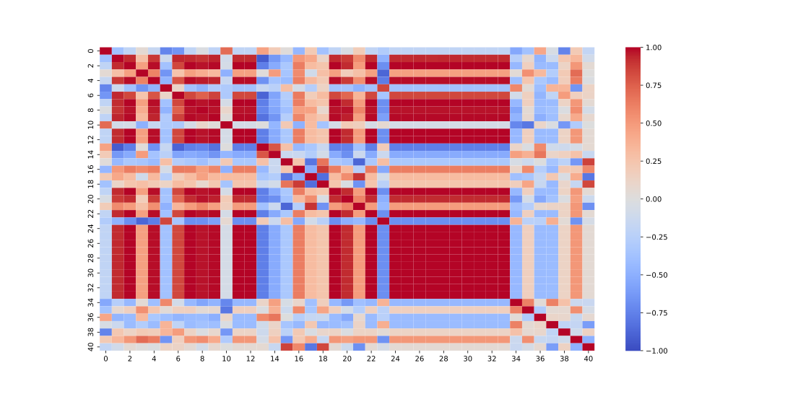

# 2024 数模国赛 C 题：农作物的种植策略

本题为优化问题，主要使用 Gurobi 和 COPT 优化器进行求解。\
两者均为商业优化器，需要在官网进行申请。

> [!WARNING]
> 推荐使用 Gurobi 优化器进行求解。COPT 语法相对不那么便捷，且 COPT 在面对 MIP 问题时求解速度较 Gurobi 慢 10 倍左右。截止目前（2025 年 1 月），COPT 优化器暂不支持非凸混合整数二次规划问题和多目标优化问题。

## 问题 1

### 问题 1.1

根据题给条件，列出优化模型如下：

- 变量：

  - $x$：农作物种植面积
  - $y$：农作物产量（与 2023 年相比较小值）
  - $z$：农作物原始产量（辅助变量）
  - $b$：水浇地是否为单季种植（0-1 变量）

- 约束条件：

  - C1：平旱地，梯田，山坡地只能种植粮食类作物
  - C2 + C3：普通大棚和智慧大棚第一季只能种植特定种类作物
  - C4：普通大棚第二季只能种植食用菌类作物
  - C5 + C6：智慧大棚第二季只能种植特定种类作物
  - B1 + B2：水浇地单季种植：只种植水稻
  - B3 + B4：水浇地双季种植（第一季）：只能种植特定作物
  - B5 + B6：水浇地双季种植（第二季）：只能种植特定作物
  - R1：种植面积不应大于地块面积
  - R2：平旱地，梯田，山坡地 3 年内必须种植豆类作物
  - R3：普通大棚 3 年内必须种植豆类作物（只需考虑第一季即可）
  - R4：智慧大棚 3 年内必须种植豆类作物（第一季 + 第二季，因为两季都可以种）
  - SOS：每个地块都不能重茬种植

> [!TIP]
>
> - GenConstrIndicator 为广义约束，即当某个二值变量为真或为假时，某个约束条件才起作用。
> - SOS 约束是一种特殊约束类型，分为 SOS_TYPE1 和 SOS_TYPE2，此处用到的为 SOS_TYPE1 类型，即某些变量中最多可以有 1 个变量取非零值。

- 目标函数：

  - T1：当年第一季度农作物总产量
  - MIN1：当年第一季总产量与 2023 年第一季总产量取较小值
  - T2：当年第二季度农作物总产量
  - MIN2：当年第二季总产量与 2023 年第二季总产量取较小值
  - profit：第一季利润 + 第二季利润 - 第一季成本 - 第二季成本

> [!TIP]
> GenConstrMin 为广义约束，即某个变量为另一些变量的最小值。

### 问题 1.2

根据题给条件，列出优化模型如下：

- 变量：

  - $x$：农作物种植面积
  - $y_{min}$：农作物产量（与 2023 年相比较小值）
  - $y_{max}$：农作物产量（与 2023 年相比较大值）
  - $z$：农作物原始产量（辅助变量）
  - $b$：水浇地是否为单季种植（0-1 变量）

- 约束条件：

  - C1：平旱地，梯田，山坡地只能种植粮食类作物
  - C2 + C3：普通大棚和智慧大棚第一季只能种植特定种类作物
  - C4：普通大棚第二季只能种植食用菌类作物
  - C5 + C6：智慧大棚第二季只能种植特定种类作物
  - B1 + B2：水浇地单季种植：只种植水稻
  - B3 + B4：水浇地双季种植（第一季）：只能种植特定作物
  - B5 + B6：水浇地双季种植（第二季）：只能种植特定作物
  - R1：种植面积不应大于地块面积
  - R2：平旱地，梯田，山坡地 3 年内必须种植豆类作物
  - R3：普通大棚 3 年内必须种植豆类作物（只需考虑第一季即可）
  - R4：智慧大棚 3 年内必须种植豆类作物（第一季 + 第二季，因为两季都可以种）
  - SOS：每个地块都不能重茬种植

- 目标函数：

  - T1：当年第一季度农作物实总产量
  - MIN1：当年第一季总产量与 2023 年第一季总产量取较小值
  - MAX1：当年第一季总产量与 2023 年第一季总产量取较大值
  - T2：当年第二季度农作物总产量
  - MIN2：当年第二季总产量与 2023 年第二季总产量取较小值
  - MAX2：当年第二季总产量与 2023 年第二季总产量取较大值
  - profit：第一季利润 + 第二季利润 - 第一季成本 - 第二季成本

## 问题 2

根据题给条件，列出优化模型如下：

- 变量：

  - $x$：农作物种植面积
  - $y_{min}$：农作物产量（与 2023 年相比较小值）
  - $y_{max}$：农作物产量（与 2023 年相比较大值）
  - $z$：农作物原始产量（辅助变量）
  - $b$：水浇地是否为单季种植（0-1 变量）
  - $ratio$：每年超出预期销售量的折扣比例

- 约束条件：

  - C1：平旱地，梯田，山坡地只能种植粮食类作物
  - C2 + C3：普通大棚和智慧大棚第一季只能种植特定种类作物
  - C4：普通大棚第二季只能种植食用菌类作物
  - C5 + C6：智慧大棚第二季只能种植特定种类作物
  - B1 + B2：水浇地单季种植：只种植水稻
  - B3 + B4：水浇地双季种植（第一季）：只能种植特定作物
  - B5 + B6：水浇地双季种植（第二季）：只能种植特定作物
  - R1：种植面积不应大于地块面积
  - R2：平旱地，梯田，山坡地 3 年内必须种植豆类作物
  - R3：普通大棚 3 年内必须种植豆类作物（只需考虑第一季即可）
  - R4：智慧大棚 3 年内必须种植豆类作物（第一季 + 第二季，因为两季都可以种）
  - SOS：每个地块都不能重茬种植

- 目标函数：

  - T1：当年第一季度农作物实总产量
  - MIN1：当年第一季总产量与 2023 年第一季总产量取较小值
  - MAX1：当年第一季总产量与 2023 年第一季总产量取较大值
  - T2：当年第二季度农作物总产量
  - MIN2：当年第二季总产量与 2023 年第二季总产量取较小值
  - MAX2：当年第二季总产量与 2023 年第二季总产量取较大值
  - profit：第一季利润 + 第二季利润 - 第一季成本 - 第二季成本

> [!TIP]
> GenConstrMax 为广义约束，即某个变量为另一些变量的最大值。

## 问题 3

### 整体思路

首先，基于问题 2 的结果，计算 41 个农作物品种之间的相关系数。若相关系数接近于 1，说明两者具有互补性。若相关系数接近于-1，说明两者具有可替代性。然后，使用线性回归，将预期销售量作为因变量，销售价格和种植成本作为自变量，根据线性回归的系数，探讨三者之间的关系。后半部分为开放求解问题，无标准答案。

